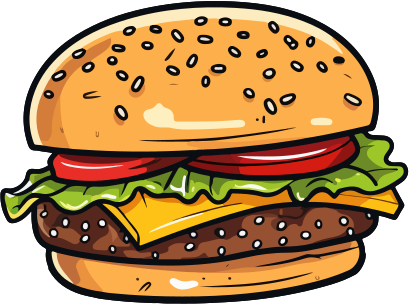

<h1>
    <a href="https://www.laboratoria.la/br">
     </a>
    <span>Projeto 05 - Burguer Queen</span>
</h1>


## 📝 Ferramentas utilizadas no sistema DataverseChat

- [Link do Projeto](https://burgersqueen.netlify.app/login)
- [Figma - Protótipo do projeto](https://www.figma.com/design/Tdl3fBEtk4Ai4eh9IM1Tbb/SAP012-burger-queen-api-mock?node-id=0%3A1&t=icNSjkHCXuL51xE9-1)


<table>
  <thead>
    <tr align="left">
      <th>Nº</th>
      <th>Status</th>
      <th>Etapas</th>
      <th>Etapas do Desenvolvimento do Projeto</th>
    </tr>
  </thead>
  <tbody align="left">
    <tr>
      <td>01</td>
      <td></td>
      <td>Marco 01 - Configuração do projeto</td>
      <td align="center">
        <a href="https://burgersqueen.netlify.app/login" target="_blank">
           
        </a>
      </td>
    </tr>
    <!-- <tr>
      <td>02</td>
      <td></td>
      <td>Marco 02 - Lista de Filmes</td>
      <td align="center">
        <a href="" target="_blank">
           
        </a>
      </td>
    </tr>
    <tr>
      <td>03</td>
      <td></td>
      <td>Marco 03 - Lista de filmes paginada</td>
      <td align="center">
        <a href="" target="_blank">
           
        </a>
      </td>
    </tr>
    <tr>
      <td>04</td>
      <td></td>
      <td>Marco 04 - Filtrar e Ordenar</td>
      <td align="center">
        <a href="" target="_blank">
           
        </a>
      </td>
    </tr>
    <tr>
      <td>03</td>
      <td></td>
      <td>Marco 05 - Detalhes do Filme</td>
      <td align="center">
        <a href="" target="_blank">
           
        </a>
      </td>
    </tr> -->
    </tbody>
  <tfoot>
  </tfoot>
</table>


## Instalação

```
npm install
ng serve
```
### Executando testes
```
ng test
```

## 💻 Página de Login


## 💻 Página de Registra um Cadastro


## 💻 Página de Registra Mesa


## 💻 Página de Produtos - Bebidas


## 💻 Página de Produtos - Lanches


## 💻 Página de Produtos - Café da Manhã


## 💻 Página de Produtos - Combos


## 💻 Página de Produtos - Saladas


## 💻 Página Modal de Enviar Pedido


## 💻 Página de Pedidos pendente com cronometro de tempo


## 💻 Página de Listar Funcionários


## 💻 Página Editar dados de Funcionário


## 💻 Página Adicionar um Novo Funcionário


<div align="center">

<br>

##### Desenvolvido por <span>Elizabete Fabri</span> ❤

</div>


